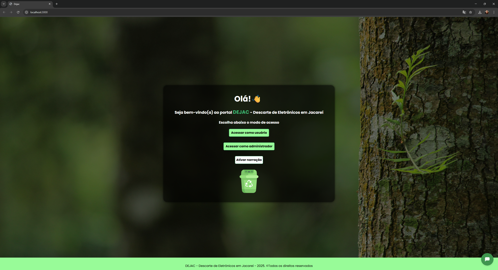
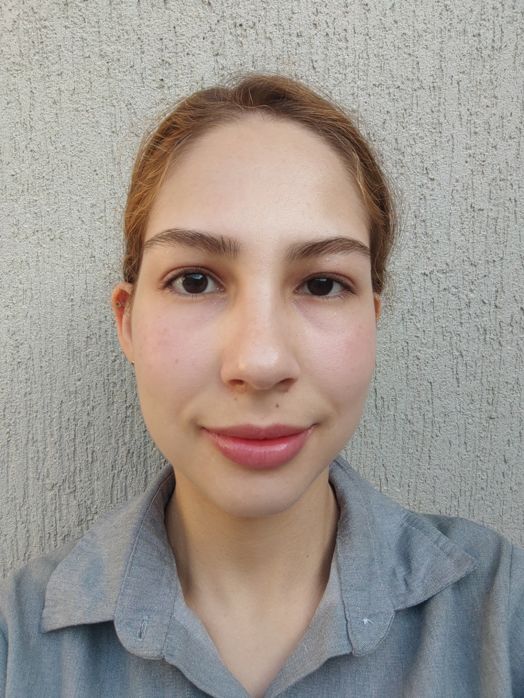

**DEJAC – Sistema Inteligente de Coleta e Análise de E-Lixo**

**Objetivo**

A aplicação DEJAC - Descarte de Eletrônicos em Jacareí é um projeto que utiliza diversas tecnologias para apresentar dados referentes a locais de entrega voluntária de materiais eletrônicos em Jacareí.

Ao acessar a aplicação, é possível obter informações relacionadas ao endereço, telefone e email dos locais, de forma a obter mais detalhes sobre o serviço de coleta e reciclagem, bem como realizar o agendamento da entrega e saber quais produtos podem ou não ser encaminhados para os pontos de entrega.

**Tecnologias**

- Linguagem de desenvolvimento: JavaScript / TypeScript
- Linguagem de marcação e estilização: HTML, CSS
- Banco de Dados - Firebase Database (Nuvem)
- Utilização da API dos correios: `https://viacep.com.br/ws/${cep}/json/`
- Acessibilidade: Narração dos textos da tela inicial, com a utilização do recurso speakText
- Controle de versão: Git/Github
- PlatformIO: Extensão para desenvolvimento com ESP32-CAM
- Teachable Machine: Treinamento de machine learning

**Ferramentas de desenvolvimento**

- Visual Studio Code (VS Code)
- NodeJS
- React
- PlatformIO
- Teachable Machine
- Firebase
- Módulo ESP32-CAM

**Equipe de desenvolvimento**

<table>
  <tr>
  <td align="center">
      
      
Bianca Pacheco Ivo

    </td>
    <td align="center">
      
Fernando Borges da Silva

    </td>
     <td align="center">
      
      
<a href="https://www.linkedin.com/in/isaias-menezes-silva/">Isaias Menezes Silva</a>

    </td>
    <td align="center">
      
Jean Luca Reis da Silva

    </td>
    <td align="center">
      
Mateus Augusto de Paula Tostes

    </td>
    <td align="center">
      
Matheus Monteiro Satiro

    </td>
    <td align="center">
      
      
Rodolfo de Almeida Santos

      
  </tr>
</table>

**Orientador**

<table>
  <tr>
    <td align="center">
      
Dener Pedro da Silva Palma

    </td>
  </tr>
</table>

**Universidade/Cursos**

- [UNIVESP - Universidade Virtual do Estado de São Paulo](https://univesp.br/)
- Cursos: Ciência de Dados, Engenharia de Computação